# Computer Science - CS50x 2026: Lecture 1 - C

────────────────────────────────────

**Video:** [CS50x 2026 - Lecture 1 - C](https://youtu.be/SlqjA04_dpk)
**Instructor:** David J. Malan
**Course:** CS50: Introduction to the Intellectual Enterprises of Computer Science and the Arts of Programming

────────────────────────────────────

## Overview

This lecture transitions from the visual, block-based programming of Scratch to the text-based language **C**. It covers the fundamental syntax of C, the process of compilation, data types, and how to use the CS50 library to interact with users. The instructor emphasizes that while the "syntax" is different, the underlying logic, functions, loops, and conditionals remains the same as in Scratch.

## Key Topics

### From Scratch to C [00:00:45]

- **The Mental Model:** The core concepts from Week 0 (functions, variables, loops, etc.) are directly applicable to C.
- **The Fire Hose Analogy:** Learning C can feel overwhelming (like drinking from a fire hose), but practice builds muscle memory for the new syntax.
- **Source Code vs. Machine Code:** Humans write **source code** (text), but computers only understand **machine code** (binary 0s and 1s).


### The Compilation Process [00:04:17]

- **Compiler:** A specialized program that translates source code into machine code.
- **Workflow:**
  1. Write code in a text editor (e.g., VS Code).
  2. Use a compiler to create an executable file.
  3. Run the executable to see the results.

  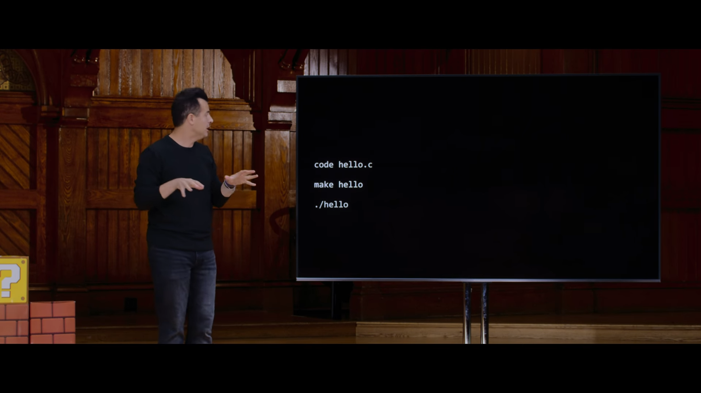

  ```bash
  # Create a file named hello.c
  code hello.c

  # Compile the code
  make hello

  # Run the executable
  ./hello
  ```

### Hello, World in C [00:16:23]

The most basic C program demonstrates several critical syntax rules:

```c
#include <stdio.h>

int main(void)
{
    printf("hello, world\n");
}
```

#### Syntax Breakdown:

- **`#include <stdio.h>`:** A preprocessor directive that tells the computer to use the "Standard Input/Output" library, which contains the `printf` function.
- **`int main(void)`:** The "entry point" of the program. Every C program starts execution here.
- **Curly Braces `{ }`:** These define the "scope" or body of a function.
- **`printf`:** A function used to print text to the screen.

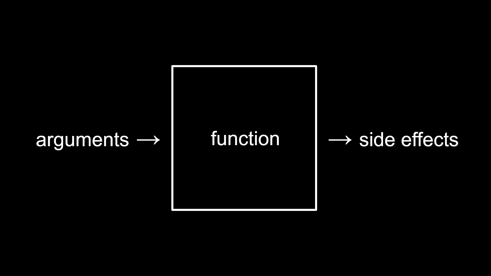

- **`\n` (Escape Sequence):** Represents a "new line." Without it, the cursor stays on the same line.
- **Semicolon `;`:** Used to terminate a statement (like a period in a sentence).

### Escape Sequences [00:19:45]

These special character combinations perform non-printing actions:

| Sequence | Action          |
| :------- | :-------------- |
| `\n`     | New Line        |
| `\r`     | Carriage Return |
| `\t`     | Horizontal Tab  |
| `\'`     | Single Quote    |
| `\"`     | Double Quote    |
| `\\`     | Backslash       |

### Header Files [00:24:10]

- C comes with a bunch of header files
- Header files don't end with .c they end with .h
- It contains code that other people wrote and can be used in our code
- We can use these header files by including them in our code using the `#include` directive
  - `#include <stdio.h>` - Standard Input/Output
  - `#include <cs50.h>` - CS50 Library
  - `#include <math.h>` - Math Library
  - `#include <string.h>` - String Library
  - `#include <stdlib.h>` - Standard Library
  - `#include <time.h>` - Time Library
  - `#include <ctype.h>` - Character Library
  - `#include <stdbool.h>` - Boolean Library
  - `#include <stdint.h>` - Integer Library

### Manual Pages [00:27:10]

- `man printf` - Manual page for printf
- `man make` - Manual page for make
- `man ./hello` - Manual page for hello

[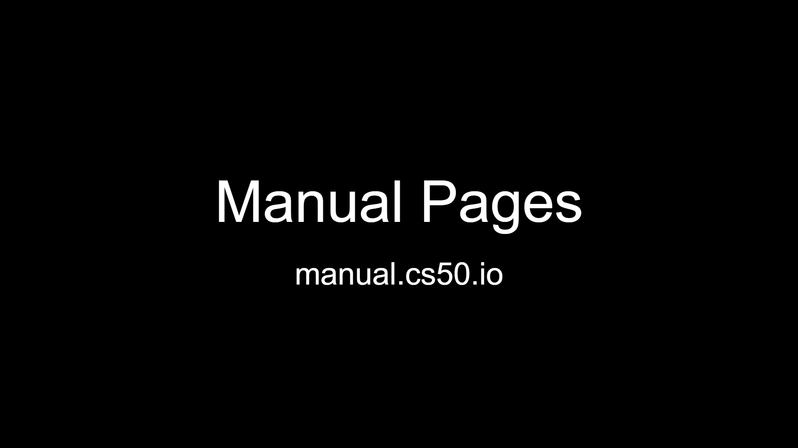](https://manual.cs50.io)

### Data Types and Format Codes [00:26:22]

C is a **statically typed** language, meaning you must specify what kind of data a variable holds.

#### Common Data Types:

- **`bool`**: Boolean (true or false).
- **`char`**: A single character.

- **`float`**: Floating-point numbers (decimals).
  - `float` uses 32 bits of memory
    - 4 billion values, 2 billion if negative numbers are included (there are infinite numbers so we can't store all of them)
- **`double`**: Double-precision floating-point numbers (more precise decimals).
  - `double` uses 64 bits of memory
    - 18 quintillion values
    - more precise but still finite (so fundamently don't solve the problem of infinite numbers)
- **`int`**: Integers (whole numbers).
  - `int` uses 32 bits of memory
    - 4 billion values, 2 billion if negative numbers are included (there are infinite numbers so we can't store all of them)
- **`long`**: Larger integers.
  - `long` uses 64 bits of memory
    - 18 quintillion values
    - more precise but still finite (so fundamently don't solve the problem of infinite numbers)
- **`string`**: A sequence of characters (requires `cs50.h`).

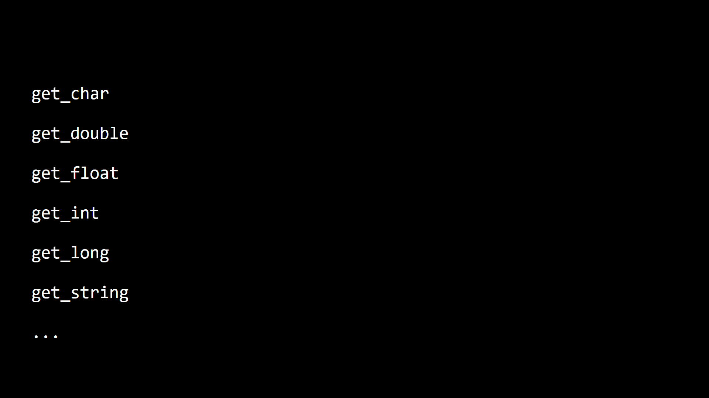

> requires `cs50.h` to be included in the code

### Using the CS50 Library [00:24:34]

To make it easier for beginners to get user input, CS50 provides custom functions:

```c
#include <cs50.h>
#include <stdio.h>

int main(void)
{
    string name = get_string("What's your name? ");
    printf("hello, %s\n", name);
}
```

- **`get_string`**: Prompts the user for text and returns a `string`.
- **`get_int`**: Prompts for an integer.
- **`get_float`**: Prompts for a decimal.

#### Format Specifiers (Placeholders):

To print variables within a string, C uses `%` followed by a letter:

| Specifier | Data Type      |
| :-------- | :------------- |
| `%i`      | int            |
| `%f`      | float / double |
| `%s`      | string         |
| `%c`      | char           |
| `%li`     | long           |

### Variables [00:27:10]

- **Variables** are used to store data in memory.
- **Variables** are declared with a data type and a name.
- **Variables** are initialized with a value.

```c
#include <cs50.h>
#include <stdio.h>

int main(void)
{
    string name = get_string("What's your name? ");
    printf("hello, %s\n", name);
}
```

### Terminal Commands [00:44:03]

### Terminal Commands

```bash
# Open VS Code
code hello.c

# List files
ls

# List files with details
ls -l

# Shows hidden files
ls -a

# List all files with details (including hidden)
ls -la

# Change directory
cd folder_name

# Go back one directory
cd ..

# Go to home directory
cd ~

# Print working directory (where you are)
pwd

# Copy file
cp hello.c hello_world.c

# Copy directory
cp -r folder1 folder2

# Make directory
mkdir folder_name

# Make nested directories
mkdir -p folder1/folder2/folder3

# Move file
mv hello.c folder/hello.c

# Rename file
mv hello.c hello_world.c

# Remove file
rm hello.c

# Remove file (force, no prompt)
rm -f hello.c

# Remove directory and its contents
rm -rf folder_name

# Remove empty directory
rmdir folder_name

# Create empty file
touch hello.c

# Print file contents
cat hello.c

# Print file contents page by page
less hello.c

# Print first 10 lines
head hello.c

# Print last 10 lines
tail hello.c

# Search for text in file
grep "hello" hello.c

# Search recursively in all files
grep -r "hello" .

# Find a file by name
find . -name "hello.c"

# Clear the terminal
clear

# Show command history
history

# Show manual/help for a command
man ls

# Show disk usage of a file/folder
du -sh folder_name

# Show available disk space
df -h

# Show running processes
ps aux

# Kill a process by ID
kill 1234

# Show who you are logged in as
whoami

# Show current date and time
date

# Create a symbolic link
ln -s original.c link.c

# Download a file from URL
curl -O https://example.com/file.c

# Compress files into a zip
zip archive.zip hello.c

# Extract a zip file
unzip archive.zip

# Compress into tar.gz
tar -czvf archive.tar.gz folder_name

# Extract tar.gz
tar -xzvf archive.tar.gz

# Run a command as superuser
sudo command

# Exit terminal
exit

# Switch to root user
sudo su

# ====== Advance commands ======

# Change file permissions
chmod 755 hello.c

# Change file owner
chown user hello.c

# Show network info
ifconfig

# Ping a host
ping google.com

# Show open ports
netstat -tulpn

# SSH into a remote server
ssh user@192.168.1.1

# Copy file to remote server
scp hello.c user@192.168.1.1:/home/user/
```

#### Increment and Decrement in Variables

```c
counter = counter + 1;
counter += 1;
counter++;

counter = counter - 1;
counter -= 1;
counter--;
```

#### compare.c

```c
#include <cs50.h>
#include <stdio.h>

int main(void)
{
    // Prompt user for integers
    int x = get_int("What's x? ");
    int y = get_int("What's y? ");

    // Compare integers
    if (x < y)
    {
        printf("x is less than y\n");
    }
    else if (x > y)
    {
        printf("x is greater than y\n");
    }
    else
    {
        printf("x is equal to y\n");
    }
}
```

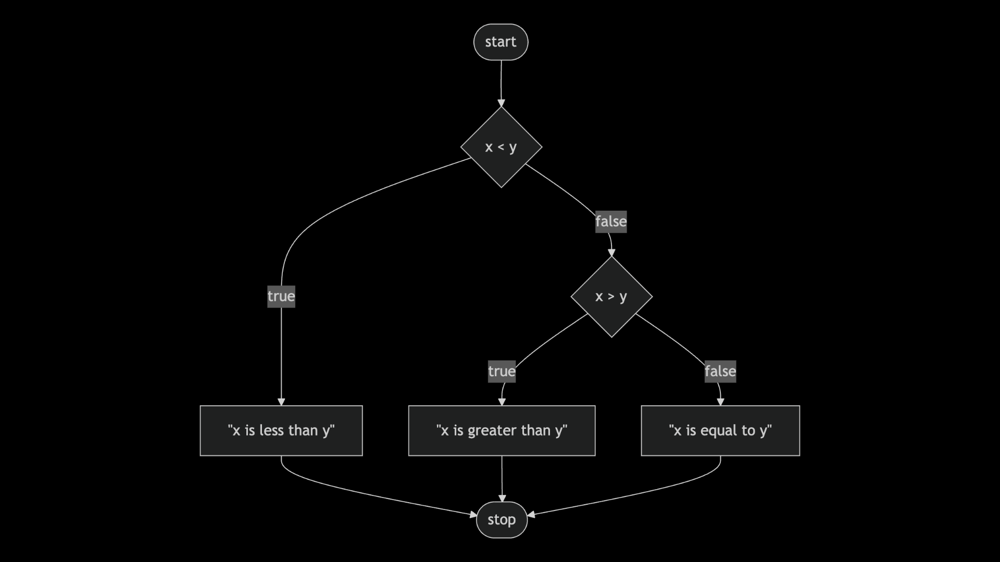

#### agree.c

```c
#include <cs50.h>
#include <stdio.h>

int main(void)
{
    // Prompt user for an answer
    char c = get_char("Do you agree? ");

    // Check whether user agreed
    if (c == 'y' || c == 'Y')
    {
        printf("agreed\n");
    }
    else if (c == 'n' || c == 'N')
    {
        printf("disagreed\n");
    }
    else
    {
        printf("invalid answer\n");
    }
}
```

#### Loops

Loops are used to repeat a block of code.

##### While Loop

```c
#include <cs50.h>
#include <stdio.h>

int main(void)
{
    int i = 0;
    while (i < 3)
    {
        printf("meow\n");
        i++;
    }
}
```

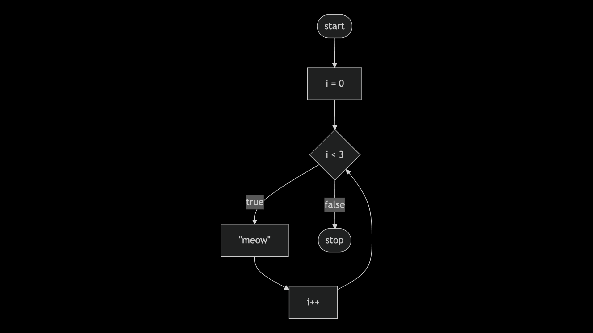

##### For Loop

```c
#include <cs50.h>
#include <stdio.h>

int main(void)
{
    for (int i = 0; i < 3; i++)
    {
        printf("meow\n");
    }
}
```

##### cat.c

```c
// Return value

#include <cs50.h>
#include <stdio.h>

int get_positive_int(void);
void meow(int n);

int main(void)
{
    int n = get_positive_int();
    meow(n);
}

// Get number of meows
int get_positive_int(void)
{
    int n;
    do
    {
        n = get_int("Number: ");
    }
    while (n < 1);
    return n;
}

// Meow some number of times
void meow(int n)
{
    for (int i = 0; i < n; i++)
    {
        printf("meow\n");
    }
}

```

### Functions [01:44:46]

Function is a block of code that performs a specific task

#### Void Function

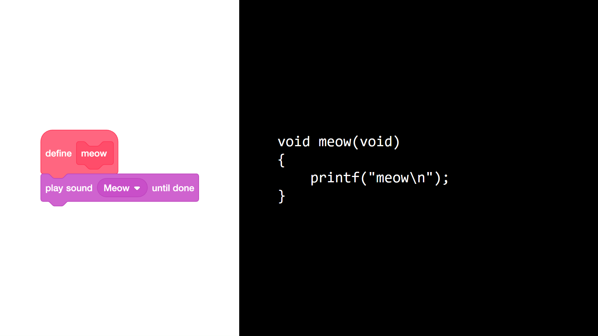

> void function is a function that does not return any value

#### Void Function with Loop

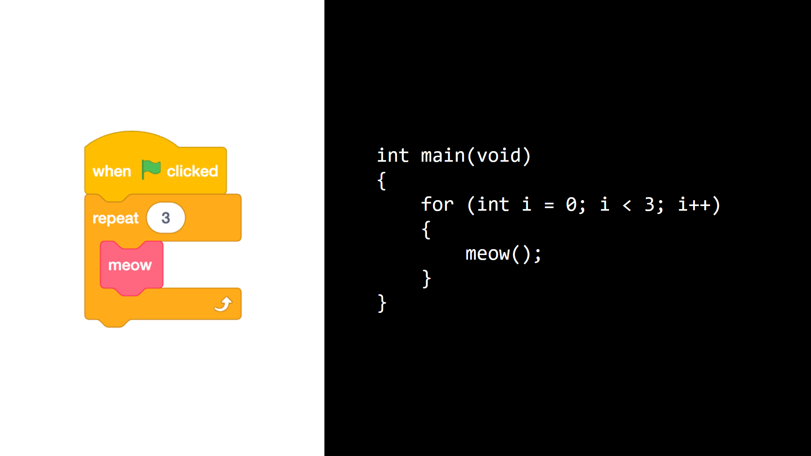

> void function can be used with loops

#### Void Function with Parameter

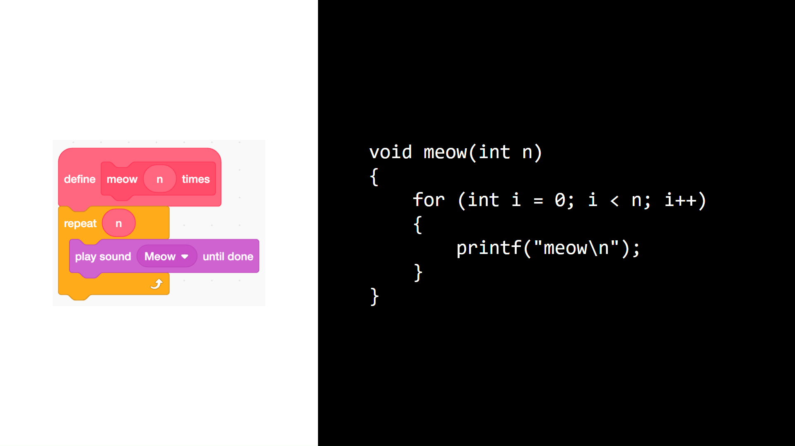

> void function can take parameters

#### Function Prototype

Function prototype is a function that is declared before it is used

```c
#include <cs50.h>
#include <stdio.h>

int get_positive_int(void);
void meow(int n);

int main(void)
{
    int n = get_positive_int();
    meow(n);
}

// Get number of meows
int get_positive_int(void)
{
    int n;
    do
    {
        n = get_int("Number: ");
    }
    while (n < 1);
    return n;
}

// Meow some number of times
void meow(int n)
{
    for (int i = 0; i < n; i++)
    {
        printf("meow\n");
    }
}
```

### Correctness, Design, Style [01:56:21]

- Correctness - does the code work as expected
- Design - does the code work as expected
  - not just correct but also well-structured
- Style - does everything is pretty printed

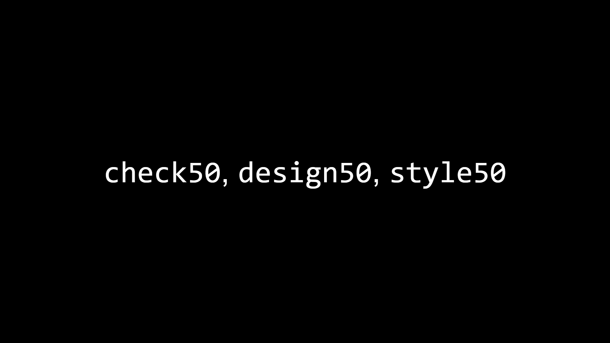

> `correct50` is a tool that checks the correctness of your code
> `style50` is a tool that checks the style of your code
> `design50` is a tool that checks the design of your code

### calculator.c

C uses standard mathematical and logical operators:

- **Arithmetic:** `+`, `-`, `*`, `/`, `%` (remainder/modulo).
- **Assignment:** `=` (sets a value), `+=`, `-=` (shorthand updates).
- **Comparison:** `==` (is equal to), `!=` (not equal), `>`, `<`, `>=`, `<=`.

#### Example: Conditional Logic

```c
if (x < y)
{
    printf("x is less than y\n");
}
else if (x > y)
{
    printf("x is greater than y\n");
}
else
{
    printf("x is equal to y\n");
}
```

#### Addition

```c
#include <cs50.h>
#include <stdio.h>

int main(void)
{
    int x = get_int("What's x? ");
    int y = get_int("What's y? ");

    printf("%i plus %i is %i\n", x, y, x + y);
}
```

#### Multiplication

```c
#include <cs50.h>
#include <stdio.h>

int main(void)
{
    int x = get_int("What's x? ");
    int y = get_int("What's y? ");

    printf("%i times %i is %i\n", x, y, x * y);
}
```

#### Subtraction

```c
#include <cs50.h>
#include <stdio.h>

int main(void)
{
    int x = get_int("What's x? ");
    int y = get_int("What's y? ");

    printf("%i minus %i is %i\n", x, y, x - y);
}
```

#### Multiplication

```c
#include <cs50.h>
#include <stdio.h>

int main(void)
{
    int x = get_int("What's x? ");
    int y = get_int("What's y? ");

    printf("%i times %i is %i\n", x, y, x * y);
}
```

#### Division

```c
// Floats

#include <cs50.h>
#include <stdio.h>

int main(void)
{
    // Prompt user for x
    float x = get_float("What's x? ");

    // Prompt user for y
    float y = get_float("What's y? ");

    // Divide x by y
    printf("%.50f\n", x / y);
}

```

### Integer Overflow [02:18:32]

Integer overflow is a problem that occurs when a number is too large to be stored in a variable
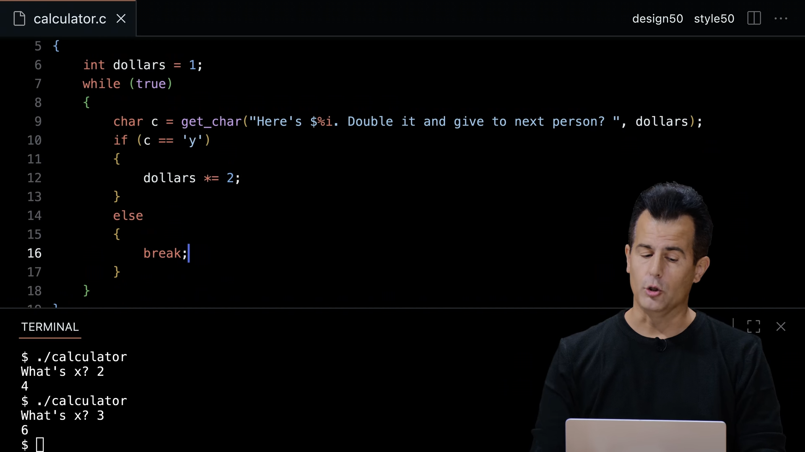
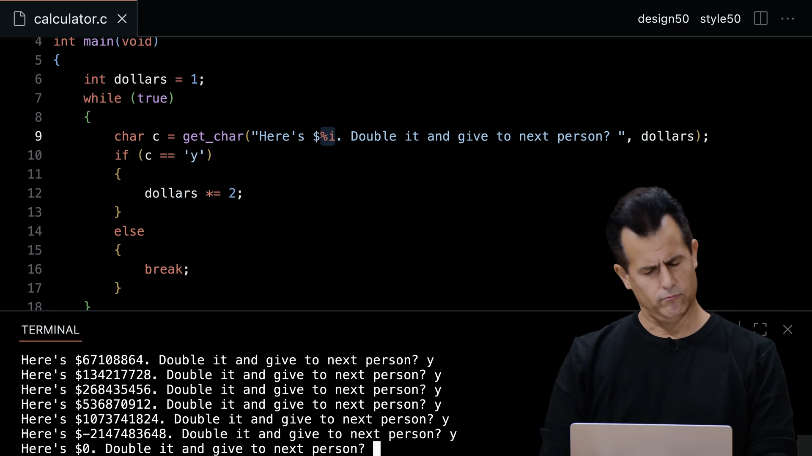

- Computers have a finite number of bits allocated to each integer:

  | Bits | Unsigned (positive only) | Signed (positive & negative)                     |
  | ---- | ------------------------ | ------------------------------------------------ |
  | 32   | ~4 billion               | ~2 billion positive, ~2 billion negative         |
  | 64   | ~18 quintillion          | ~9 quintillion positive, ~9 quintillion negative |

  > Because bits are finite, integers have a maximum value, exceeding it causes **overflow**.

  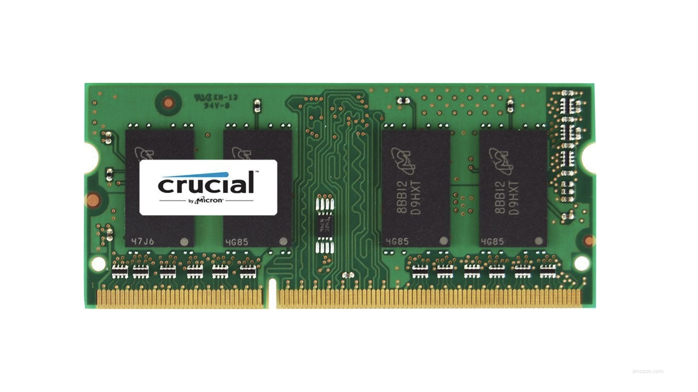

- **Reason for integer overflow** RAM is physical and limited. Every integer variable is assigned a
  fixed number of bits in memory. When a calculation produces a value larger than those bits can hold,
  the extra bits have nowhere to go and are discarded, causing the number to **wrap around**
  (e.g. max value + 1 becomes 0 or a large negative number).

```
  // 32-bit unsigned example
  4,294,967,295 + 1 = 0        ← wraps back to zero

  // 32-bit signed example
  2,147,483,647 + 1 = -2,147,483,648  ← flips to most negative number
```

#### 3 bit counting

```binary
000  0
001  1
010  2
011  3
100  4
101  5
110  6
111  7
1000 0  ← overflow
```

#### Real-World Example: Boeing 787 Integer Overflow

A real-world example of integer overflow was found in the **Boeing 787 Dreamliner**.

- **The Symptom** — If the plane was powered on continuously for **248 days**, it would lose
  all alternating current (AC) electrical power, as the Generator Control Units (GCUs)
  would enter failsafe mode.

- **The Technical Cause** — A software counter inside the GCUs was stored as a **32-bit integer**
  counting in tenths of a second. After 248 days of continuous operation, the counter exceeded
  the maximum value a 32-bit integer can hold and **overflowed**, triggering the failsafe.

#### Pac-Man Kill Screen Bug [02:24:34]

When a player reaches **level 256** in the original Pac-Man (1980), the game breaks and
displays a corrupted, unplayable screen — famously known as the **"kill screen"**.

- **The Cause** — The level counter was stored as an **8-bit integer**, which can only
  hold values from 0 to 255. When the game tried to load level 256, the counter
  **overflowed back to 0**, causing the game to malfunction and render the right half
  of the screen as garbage data.

#### Floating-Point Imprecision and Overflow [02:26:22]

- **Floating-Point Imprecision:** Computers have a finite number of bits. Representing a number like 1/3 results in an approximation (e.g., `0.3333333432...`) because you can't store infinite digits.
- **Integer Overflow:** When a number exceeds the maximum value a data type can hold, it "wraps around" to a negative number.
- **The Year 2038 Problem:** Many systems use 32-bit integers to count seconds from 1970. On Jan 19, 2038, these counters will overflow, potentially causing massive system failures.

#### Truncation [02:25:54]

Truncation occurs when a number loses its decimal (fractional) part because it is
stored in a variable that can only hold integers.

- **The Cause** — When you divide two integers in most programming languages, the result
  is stored as an integer. The decimal part is not rounded — it is simply **cut off**.

```c
  int x = 1 / 3;   // result is 0, not 0.333...
  int y = 7 / 2;   // result is 3, not 3.5
```

- **The Fix** — Use a `float` or `double` to preserve the decimal part:

```c
  float x = 1.0 / 3.0;   // result is 0.333...
  float y = 7.0 / 2.0;   // result is 3.5
```

- **The Danger** — Truncation is silent — the program does not crash or warn you.
  You simply get a wrong answer without knowing it.

#### Year 1999 and 2038 Problem

Both are real-world examples of what happens when time is stored in a finite number of bits.

---

**Year 2000 Problem (Y2K)**

Early computers stored the year using only **2 digits** to save memory (e.g. `99` for 1999).
When the year 2000 arrived, `99 + 1 = 00` — computers interpreted this as the year **1900**,
not 2000, potentially causing incorrect calculations and system failures.

```
1999  →  stored as  99
2000  →  stored as  00  ← interpreted as 1900
```

> Governments and companies spent billions fixing this before January 1, 2000.
> It was a form of **truncation** — storing less data than needed.

---

**Year 2038 Problem**

Unix-based systems store the current time as the number of seconds since
**January 1, 1970** (called Unix time), in a **32-bit signed integer**.

```
32-bit signed max = 2,147,483,647 seconds
                  = January 19, 2038 at 03:14:07 UTC
```

On that date, the counter will overflow and wrap to a large negative number,
causing systems to interpret the time as **December 13, 1901**.

```
2,147,483,647 + 1 = -2,147,483,648  ← overflow
                  = December 13, 1901
```

- **The Fix** — Migrate to a **64-bit integer** for storing time, which can count
  seconds for approximately **292 billion years** before overflowing.

> Many older embedded systems (routers, appliances, industrial devices) still use
> 32-bit time — the 2038 problem is not fully solved yet.

## Key Takeaways

- **Precision Matters:** Missing a single semicolon or quote will cause a "compile-time error."
- **Read the Errors:** C error messages are often long but provide the file name and line number where the issue occurred.
- **Abstraction:** Libraries like `cs50.h` and `stdio.h` allow us to use complex code (like printing or getting input) without knowing exactly how the computer handles the hardware.
- **Memory is Finite:** Always be aware of the limits of your data types (`int` vs `long`) to avoid overflow and imprecision.

────────────────────────────────────

_"CS50 is about empowering you with solutions to these problems. See you next time."_

```


http://googleusercontent.com/youtube_content/2
```
